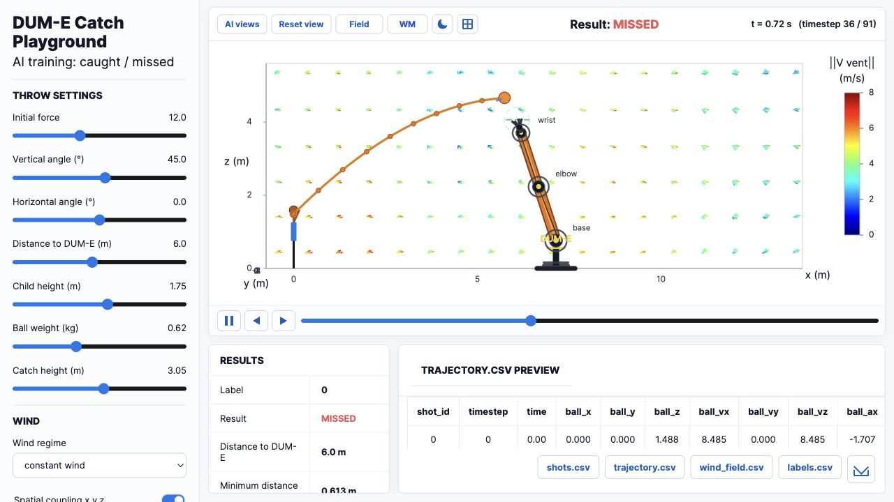

# DUM-E Catch Playground

Interactive playground for simulating throws toward DUM-E, generating synthetic catch data, and testing a world-model/controller pipeline.

## Live Demo

[Open the Vercel deployment](https://dum-e-interface.vercel.app)



## What It Does

- Visualizes ball trajectories, wind regimes, DUM-E arms, and catch/miss outcomes.
- Generates synthetic training data for world-model experiments.
- Includes local Python tooling for training a world model and a catch controller.
- Can run the browser UI without the local inference server; when the server is available, the `WM` mode overlays model predictions.

## Project Structure

```text
interface/              Browser UI and canvas simulation
dataset_generation/     Synthetic throw physics and dataset builders
model/                  Feature contracts, kinematics, models, training scripts
server/                 Local HTTP inference server for prediction overlays
model/artifacts/        Local trained weights, ignored by Git
```

## Run The UI Locally

```bash
python3 -m http.server 8770
```

Then open:

```text
http://localhost:8770/interface/index.html
```

## Optional Python Setup

```bash
python3.11 -m venv .venv
.venv/bin/python -m pip install -r requirements.txt
```

Start the local prediction server:

```bash
./start_server.sh
```

## Useful Commands

```bash
.venv/bin/python -m model.training.train_world_model --shots 800 --epochs 14 --output-dir model/artifacts
.venv/bin/python -m model.training.train_catch_controller --world-model-path model/artifacts/dum_e_world_model.pt --shots 500 --epochs 8 --output-dir model/artifacts
```
